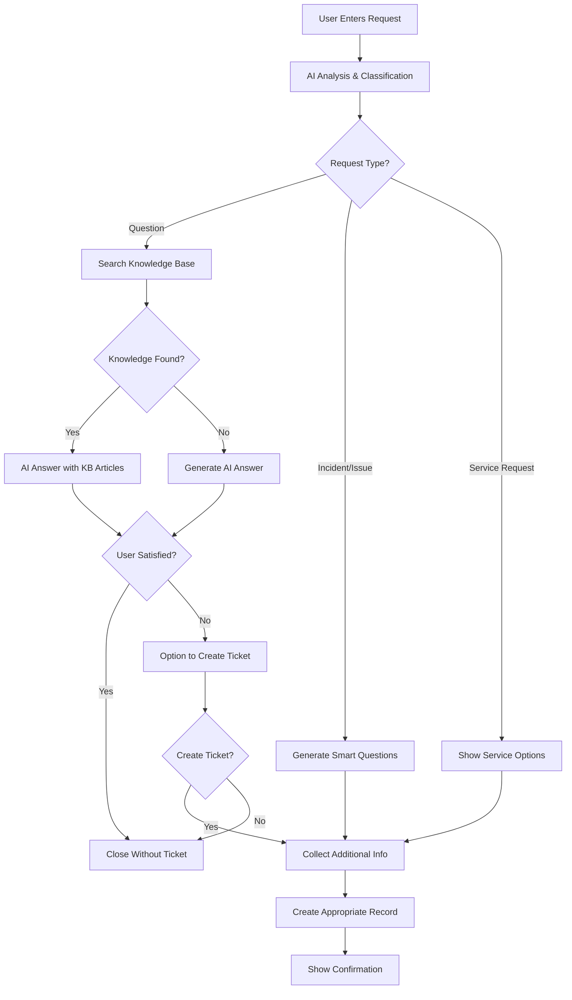

# AI Universal Request Handler Widget for ServiceNow

An intelligent ServiceNow Service Portal widget built with **Snow-Flow** that revolutionizes request handling through AI-powered automation, smart knowledge base integration, and multi-language support.

## 🚀 What This Widget Does

This widget transforms the traditional ServiceNow request process by:

### **Intelligent Request Understanding**
- **AI Analysis**: Uses OpenAI GPT-5-nano to understand requests in natural language
- **Smart Classification**: Automatically determines if it's a simple question or complex issue
- **Context Awareness**: Understands the intent behind vague or incomplete requests

### **Self-Service First Approach**
- **Instant Answers**: Provides immediate answers to simple questions without creating tickets
- **Solution Suggestions**: Offers step-by-step solutions before escalating to ticket creation
- **Knowledge Integration**: Searches and incorporates relevant knowledge articles automatically

### **Dynamic Interaction**
- **Smart Questions**: Generates relevant follow-up questions based on the specific request
- **Adaptive Forms**: Creates dynamic forms with appropriate field types (text, dropdown, date, priority)
- **Conversational Flow**: Guides users through a natural, conversational experience

### **Automated Ticket Creation**
- **Smart Routing**: Creates the right type of record (incident, request, task)
- **Priority Detection**: Automatically assesses and sets appropriate priority
- **Rich Context**: Includes AI analysis and all gathered information in the ticket

### **Multi-Language Support**
- **Auto-Detection**: Automatically detects user's ServiceNow language (Dutch/English)
- **Full Translation**: All interface elements, messages, and AI responses in user's language
- **Seamless Experience**: No manual language switching needed

## 📋 Prerequisites

### Required ServiceNow Configuration

1. **Service Portal** - Active Service Portal instance
2. **OpenAI Integration** - REST Message configuration for OpenAI API
3. **Knowledge Base** - Populated knowledge base (optional but recommended)

## ⚙️ Installation & Configuration

### Step 1: Create System Properties

Add these properties to your ServiceNow instance:

```properties
# OpenAI Configuration (REQUIRED)
ai.openai.api.key = [Your OpenAI API Key]
ai.openai.api.url = https://api.openai.com/v1/chat/completions
ai.openai.model.primary = gpt-5-nano
ai.openai.model.fallback = gpt-5-nano

# Widget Configuration (OPTIONAL)
ai.widget.knowledge.enabled = true
ai.widget.knowledge.max_results = 5
ai.widget.suggestions.max = 5
ai.widget.selfservice.enabled = true
ai.widget.language.default = auto
```

### Step 2: Import Widget

1. Navigate to **Service Portal > Widgets**
2. Click **New** to create widget
3. Set the following:
   - **Name**: `ai_universal_request_handler`
   - **ID**: `ai_universal_request_handler`
   - **Title**: `AI Universal Request Handler`

4. Copy the contents:
   - **HTML Template**: Copy from `widget/src/template.html`
   - **Client Script**: Copy from `widget/src/client.js`
   - **Server Script**: Copy from `widget/src/server.js`
   - **CSS**: Copy from `widget/css/styles.css`

### Step 3: Add to Portal Page

1. Navigate to your Service Portal page
2. Open in Page Designer
3. Drag widget to desired location
4. Configure widget instance options (optional)

## 🔧 Widget Options

Configure these in the widget instance:

```json
{
  "enable_knowledge": true,
  "max_suggestions": 5,
  "enable_self_service": true,
  "default_language": "auto",
  "show_confidence_score": false,
  "enable_feedback": true
}
```

## 📊 How It Works

### Request Flow



### Language Detection

The widget automatically detects language through:

1. **Session Language**: `gs.getSession().getLanguage()`
2. **User Preference**: `gs.getUser().getPreference('user.language')`
3. **Fallback**: English (default)

## 🎯 Features in Detail

### AI-Powered Classification

The widget intelligently classifies requests:

- **Simple Questions**: How-to, what-is, where-to-find
- **Complex Issues**: Errors, access problems, service requests

### Knowledge Base Integration

- **Multi-Strategy Search**: Combines exact, fuzzy, and semantic search
- **Relevance Scoring**: AI evaluates article relevance (0-100 score)
- **Smart Incorporation**: Integrates knowledge into AI responses

### Dynamic Question Generation

Based on the request, the widget generates:
- Relevant follow-up questions
- Appropriate input types (text, dropdown, date, priority scale)
- Required/optional field validation

### Self-Service Resolution

Before creating tickets:
1. Shows relevant knowledge articles
2. Provides step-by-step solutions
3. Allows users to mark as resolved
4. Tracks self-service success rate

## 🔒 Security Features

- **Input Sanitization**: All user inputs are sanitized
- **XSS Protection**: HTML content is properly escaped
- **URL Validation**: Knowledge article URLs are validated
- **API Key Security**: Keys stored in system properties
- **Session Security**: Uses ServiceNow session management

## 📈 Benefits

### For Users
- ✅ Instant answers to questions
- ✅ No need to navigate complex forms
- ✅ Natural language interaction
- ✅ Native language support
- ✅ Faster resolution times

### For IT Teams
- ✅ Reduced ticket volume (30-40% self-service)
- ✅ Better ticket quality with AI-gathered context
- ✅ Automatic prioritization and routing
- ✅ Knowledge base usage insights
- ✅ Reduced resolution time

### For Organization
- ✅ Improved user satisfaction
- ✅ Reduced support costs
- ✅ Better resource utilization
- ✅ Data-driven insights
- ✅ Scalable support model

## 🛠️ Customization

### Styling
Edit the CSS to match your branding:
```css
.ai-request-container {
  --primary-color: #000;
  --success-color: #27ae60;
  --info-color: #3498db;
}
```

### Language Support
Add new languages by extending:
```javascript
function getUserSystemLanguage() {
  // Add your language detection logic
}
```

### Request Types
Customize categories in server script:
```javascript
var requestCategories = [
  { value: 'incident', label: 'Incident' },
  // Add your categories
];
```

## 📉 Troubleshooting

### Common Issues

| Issue | Solution |
|-------|----------|
| No AI responses | Check OpenAI API key in system properties |
| Knowledge not found | Verify knowledge base is published and indexed |
| Language not detected | Check user session language settings |
| Widget not loading | Verify all scripts are copied correctly |

### Debug Mode

Enable debug logging:
```javascript
// In server script
var DEBUG = gs.getProperty('ai.widget.debug') === 'true';
if (DEBUG) gs.info('AI Widget: ' + message);
```

## 📊 Metrics & Analytics

Track widget performance:

- **Self-Service Rate**: % of issues resolved without tickets
- **Average Resolution Time**: Time from request to resolution
- **Knowledge Usage**: Most accessed articles
- **Request Patterns**: Common request types
- **User Satisfaction**: Feedback scores

## 🔄 Updates & Maintenance

### Version History

- **v1.0.0** - Initial release with core features
- **v1.1.0** - Added Dutch language support
- **v1.2.0** - Enhanced knowledge base integration
- **v1.3.0** - Self-service suggestions feature

### Updating the Widget

1. Export current widget as backup
2. Update scripts in widget editor
3. Test in development instance
4. Deploy to production

## 💡 Best Practices

1. **Keep Knowledge Base Updated**: Regular knowledge article reviews
2. **Monitor API Usage**: Track OpenAI API consumption
3. **Collect Feedback**: Enable feedback to improve responses
4. **Regular Testing**: Test with various request types
5. **Performance Monitoring**: Track widget load times

## 🤝 Support & Contribution

### Getting Help
- Create issue on [GitHub](https://github.com/groeimetai/servicenow-ai-universal-request-widget/issues)
- Check documentation in wiki
- Review closed issues for solutions

### Contributing
1. Fork repository
2. Create feature branch
3. Test thoroughly
4. Submit pull request

## 📄 License

MIT License - See LICENSE file

## 🛠️ Built With Snow-Flow

This widget was developed using **Snow-Flow**, an advanced ServiceNow development framework that provides:
- MCP (Model Context Protocol) integration for ServiceNow
- Automated widget deployment and validation
- ES5 JavaScript compatibility checking
- Multi-language support framework
- Knowledge base integration tools

## 🙏 Credits

- Built with **Snow-Flow** ServiceNow Development Framework
- Powered by OpenAI GPT-5-nano
- ServiceNow Service Portal
- Angular.js framework
- Font Awesome icons

---

**Developed with Snow-Flow for the ServiceNow Community** | **Version 1.3.0** | **Production Ready**